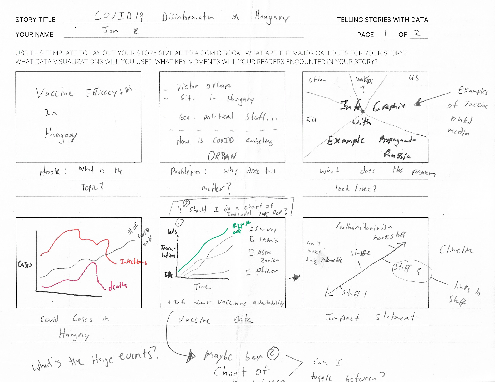
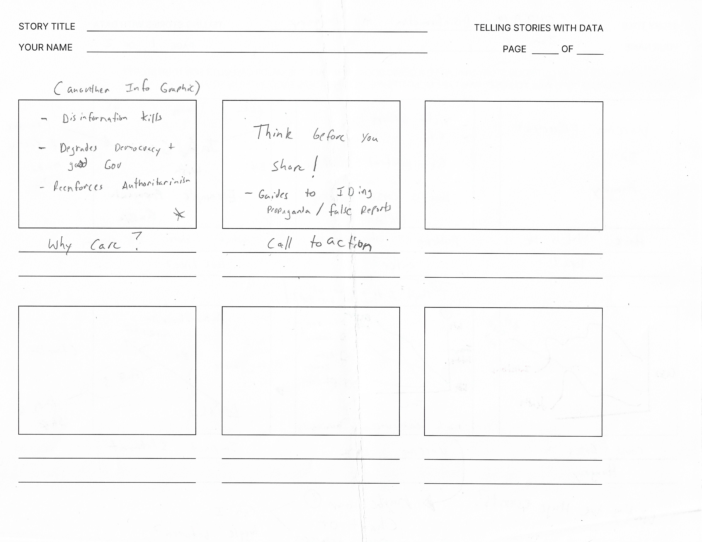
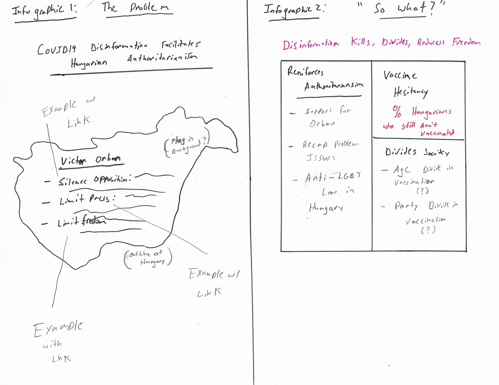
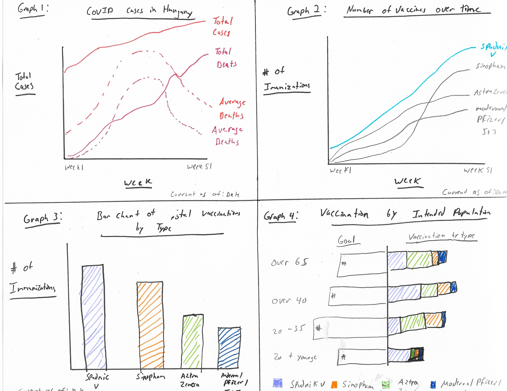

# Final Project Part 1

## *Project Outline*

##### _Summary:_ 
This project will evaluate COVID19 disinformation as it relates to vaccine efficacy amongst the Spudnik V, SinoPharm, AstraZeneca, and Moderna/Pfizer/Johnson&Johnson vaccine distribution in Hungary. The intent is to demonstrate how disinformation can influence important health, political, or social issues. 

##### _Outline:_

__Intended  Audience:__ 

Primary - Anyone concerned about COVID19, disinformation, or the rise of authoritarianism

Secondary - Policy makers

__Frame 1:__ Introduction - Introduce the topic with a few disinformation examples (political cartoons maybe?) 

__Frame 2:__ The Problem- The next frame will highlight how Victor Orban has used the pandemic to consolidate authoritarian rule. I also need to explain "Why Hungary?" The answer is, while Hungary is an EU member, it is the only EU allowing the use of Spudnik V vaccines and one of the few allowing the SinoPharm vaccines. Additionally, Russia and China have significant economic and political interests, making Hungary an ideological 'battleground' between major powers. 

- Silence Opposition: Orban's administration created fake news that opposition parties did not want people to get vaccinated so people would die and it would make Orban look bad ahead of next year's election.
- Limit Free Press: Create more standards concerning what can and cannot be published by state ran media (Soft Censursihip)
- Limit freedom of assembly: In the wake of the 2022 election, Orban can use 'public health' mandates to limit opposition rallies or organizing activities

__Frame 3:__ Example COVID 19 Disinformation or Information- An interactive infographic would be useful to allow users the opportunity to explore types of missinformation or media related to COVID19. This would give the viewer a better understanding of the media environment.

__Frame 4:__ Graph #1- A simple line chart of COVID19 cases and deaths

__Frame 5:__ Graph #2: A simple line chart of the four main vaccines available to Hungarians. This will demonstrate the viewer changes in innoculation over time. 
             Graph #3: A bar chart of total vaccines adminstered by type to illustrate the viewer which vaccines have been more popular. 
         
*Note:* I will need to explain the process of Hungarian vaccination since people can activly choose which vaccine to receive. 

__Frame 6:__ Graph #4: Illustration of vaccination rates by type and age. The intent with graph #4 is to show any trends in vaccination rates by age. Perhaps certain age categories prefer certain types of vaccines over others. The only limitaion is that the Hungarian Government rquires people under 65 with underlaying health conditions to receive the AstraZenca vaccine. 

__Frame 7:__ The 'So What?' of Vaccine Disinformation- The intent here is to outline the consequences of vaccine related disinformation in Hungary. The main consequences are: 
1) Increased death due to vaccine hesitency
2) Increased Authoritarinism, Victor Orban uses COVID19 disinformation to consolidate power 
3) Increased National disunity

__Frame 8:__ Call to Action- My call to action will be "Think before you share." The intent is to make people think before they share things on social media, which is particularly virulant vector for disinformation. I will also include links to resrources to help identify disinformation. 

[NPR Fake News Tool Kit](https://www.npr.org/2019/10/29/774541010/fake-news-is-scary-heres-how-to-spot-misinformation)

[ABC News Five Questions to Ask about Social Media Posts](https://abcnews.go.com/US/ways-spot-disinformation-social-media-feeds/story?id=67784438)

[Where to Check Disinformation Trends: DoS Disinfo Cloud](https://disinfocloud.com/)

__Project Goal:__ I hope this project increases awareness around disinformation and how a public health emergency, or any other black swan event, might be used by authoritarian governments to crush political opposition. I would also like viewers to become more aware consumers of information. The things they share might lead to someone they know not getting vaccinated, which increases everyone's risk.

## *Sketches* 

I included an in class wire diagraming exercise because it helped to organize the flow of my initial story. 

The infographics, I hope, will make a point concerning the problem and the importance of my topic with minimal text. The intent is to use as few words as possible in the story so that the viewer can quickly consume the information. 

For graph 1, I am still considering if I should put some historical events related to COVID19. As an example, in September 2020, the official Twitter account of the Hungarian Government was suspended. It might be helpful to see that kind of event against COVID19 cases and deaths. Note: none of the graphs are accurate because I have not begun to analyze the data yet. The data is represented to illustrate my stylistic thoughts concerning the type of graphs I should use. 

## *The Data* 

The primary source of Hungarian COVID19 related data is the European Centre for Disease Prevention and Control (ECDC). The ECDC is a European Union agency "aimed at strengthening Europe's defenses against infectious diseases." The data is relatively easy to manipulate. The only data cleaning it required was to extract the Hungary-specific information and clean up the date formats. 

I took two data sets from the ECDC website. The first data set is EU COVID19 data that shows the number of COVID19 cases and related deaths. I plan on using this data to show 'how bad' COVID19 was and is in Hungary. The second data set I pulled is the number of COVID vaccinations in Hungary by vaccination type, age, and date. I hope to use this data to illustrate which vaccines are more popular. Because each vaccine is from a different country (Russia, China, Great Britain, and the US, respectively), this might indicate what information or disinformation resonates with Hungarians. The tricky part here is relating vaccination to specific information campaigns. 

[Raw EU COVID19 Data](https://www.ecdc.europa.eu/en/publications-data/data-covid-19-vaccination-eu-eea)

A copy of the cleaned data can be found at [Hungarain COVID19 Data](https://github.com/Jonr1944/JReisherPortfolio/blob/main/HU_COVID%20Cases_%20JAN2020_MAY2020.xlsx) and [Hungarian Vaccination Data](https://github.com/Jonr1944/JReisherPortfolio/blob/main/HU_COVID_Vaccination%20Data_cleaned.xlsx).

Facebook has over 95% usage rate amongst Social Media Users in Hungary. The [Offical Facebook Page](https://www.facebook.com/kormanyzat) of the Hungarian Government is an excellent source of official information that the Administration of Victor Orban is putting out. This page can be used to understand what official COVID19 information is being distributed. Other sources for Hungarian News examples are official state media [Hungary Today](https://hungarytoday.hu/) and [Daily News Hungary](https://dailynewshungary.com/).

While Facebook is preferable for understanding the internal Hungarian media environment, Twitter is ideal for understanding how Hungarian media interacts globally. Twitter offers four Application Programming Interfaces (API) to search Twitter content. The [Twitter APIs](https://developer.twitter.com/en/docs) that would be most useful is the main Twitter API which enables a user to conduct analytics on Twitter content and Twitter Ads API, which helps users find information on Twitter Advertising. 

## *Method and Medium* 

In terms of constructing my project, I plan to use ShortHand. I plan to use ShortHand because I have built several presentations with Esri's Story Map and would like to learn a new platform. Currently, I plan to use Tableau to build most of the data visualizations (all four graphs). If needed, I might use R to help with complex statistical analysis because I am comfortable with R. I think I will need to make at least two infographics. One infographic for  Frame 2, describing the problem, and another one for Frame 7, the presentation "So What?" section. For constructing my infographics, I plan on using a website called [Canva](https://www.canva.com) which specializes in infographic development.

For now, I plan on using my final ShortHand product for the final 60-second presentation. The reason is that I think it will be a good test if my ShortHand site is easily consumable. Disinformation and vaccine efficacy are very complex topics. So my data visualizations and content must be consumable. If a person can scroll through the site in 60 seconds and understand the information, they are more likely to reengage with content after I have their interest. 

[Home](JreisherREADME.md)

[Final Project Part II](final_project_partII.md)

[Final Project Part III](final_project_partIII.md)
