# Final Project Part II

## Work Flow Summary

*Issues:* Overall, I spent far too much time building my Twitter API and trying to get my Tableau charts to render on the webpage. I am not very good at coding in HTML or Java, so Shorthand does not render Tableau Online charts. I will probably be forced to rebuild my charts on Flourish or make them into PDFs.

*Opportunities:* My user research results really helped me dial in where I can be more persuasive and how to rearrange my charts to build a more persuasive story. It's relatively easy to build an individual chart. But its far more difficult to create something that lands with the audience. 

#### Key Findings

I found that 1.8 million Hungarians chose to get the Spudnik V vaccine out of a possible 2 million through my research. This is significant because that indicates that out of Hungary's 9.7 million people, around 18.5% view Russia as the most legitimate or trustworthy vaccine production. 

Another key finding is that the majority of the COVD19 related hashtags are either natural (could be used for information or disinformation) or negative (are used for disinformation). There were no objectively positive hashtags trending in Hungary last week. In fact, one of the hashtags is the name of a Far-Right Opposition leader.

Finally, there is a disparity in second dose vaccination for those who received the Pfizer/BioNTech vaccine. Over 500,000 people failed to get their second dose, far greater than another group that received Russian, Chinese, or British vaccines. 

#### Insights

Twitter data is challenging to work with for a visualization project. However, it is impossible to work with Facebook data at present. This is because Facebook privacy laws do not allow researchers or third parties to analyze content. This is unfortunate because an estimated 95% of Hungarians have Facebook and only 2% have a Twitter page. Twitter, however, is a good indication of what Hungarian parities or organizations are trying to signal to people, organizations, and countries outside of Hungary with higher Twitter presences. 

## Storyboard

[Short Hand Diagram](https://preview.shorthand.com/xMs1tWmyeM72R0Af)

Below are the slides that I sent my user research participants. I would have preferred to send them a draft of the short hand website; given my Tableau rendering issues, I had to improvise with a PDF. This was a tad problematic in that I did not have the corresponding text to go along with the charts. However, the user research yielded some excellent feedback on how I could make the story more compelling. 

Frame 1:

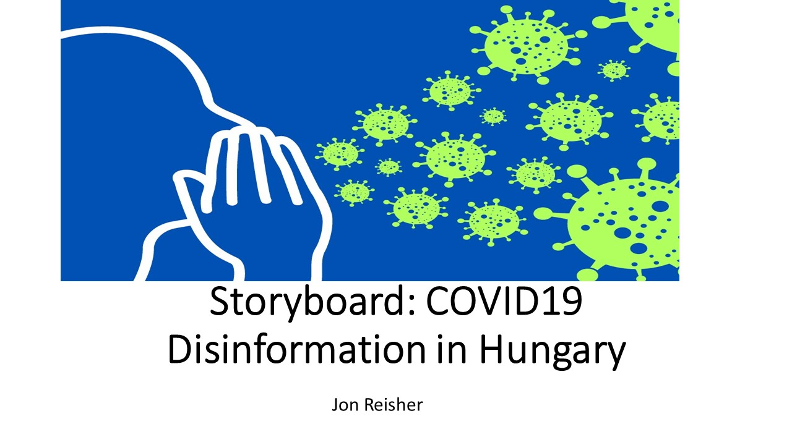

Frame 2:

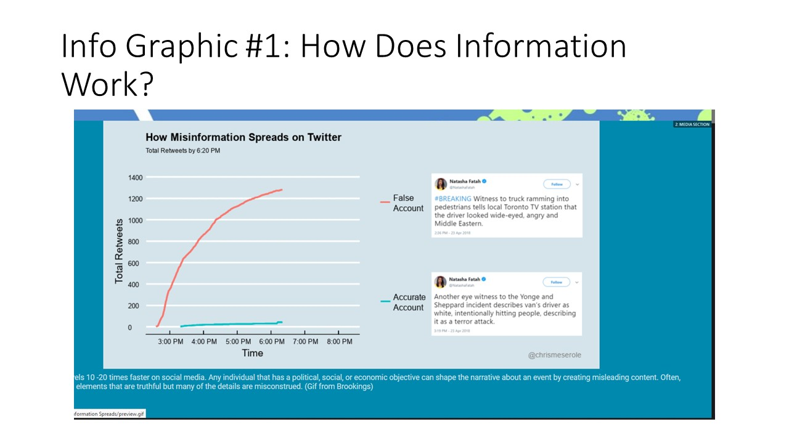

Frame 3:

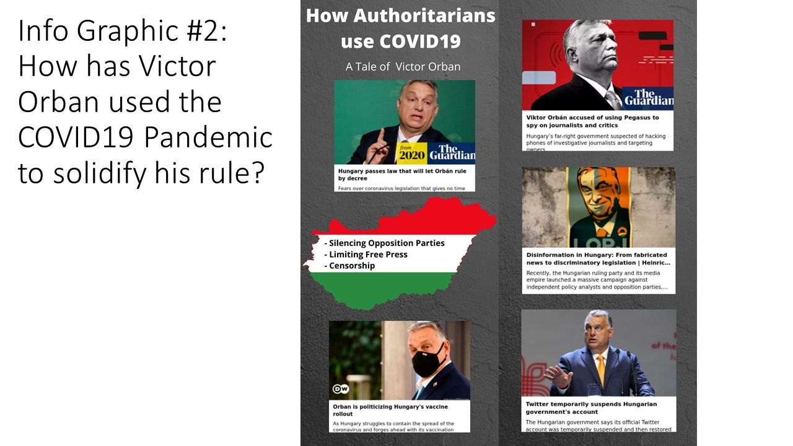

Frame 4:

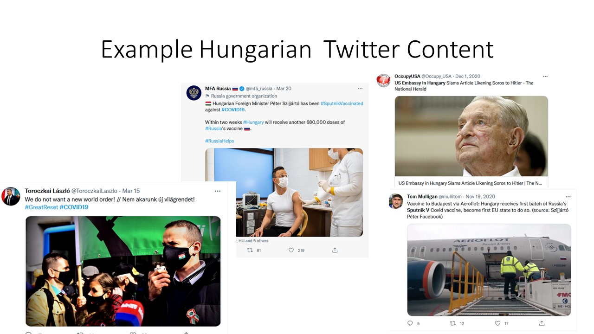

Frame 5:

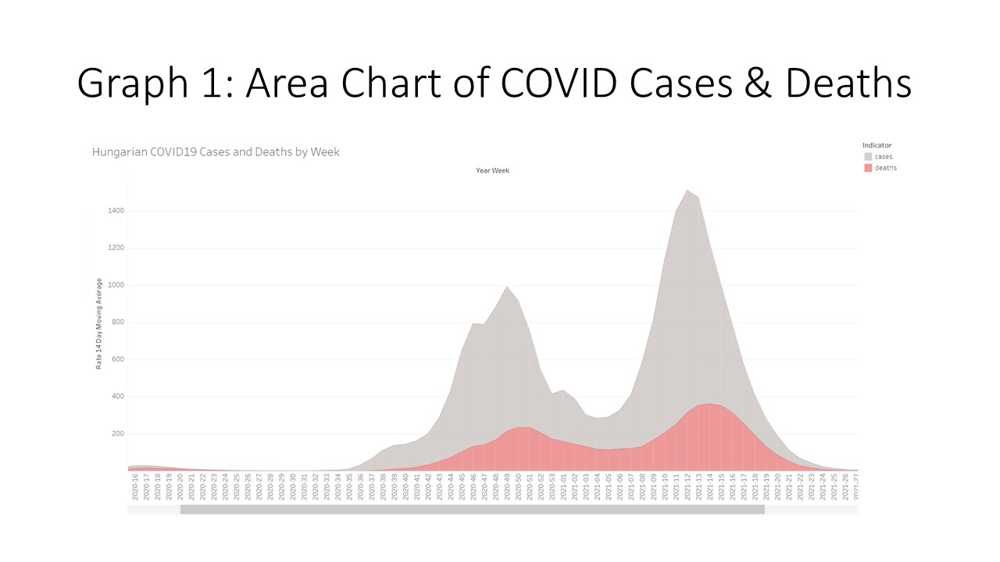

Frame 6:

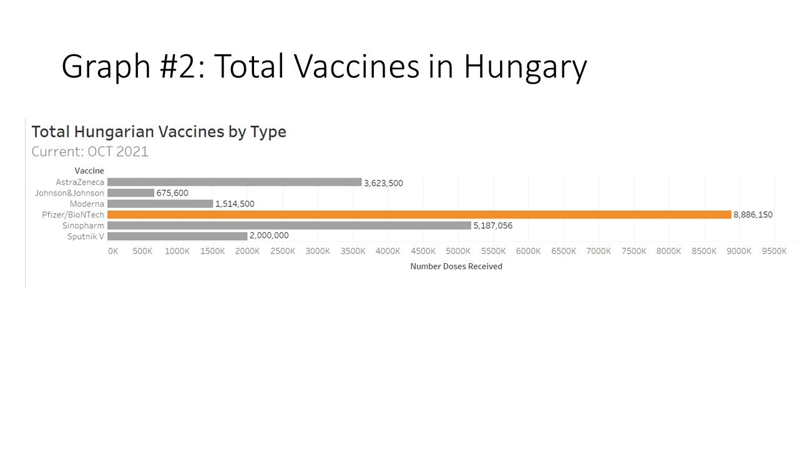

Frame 7:

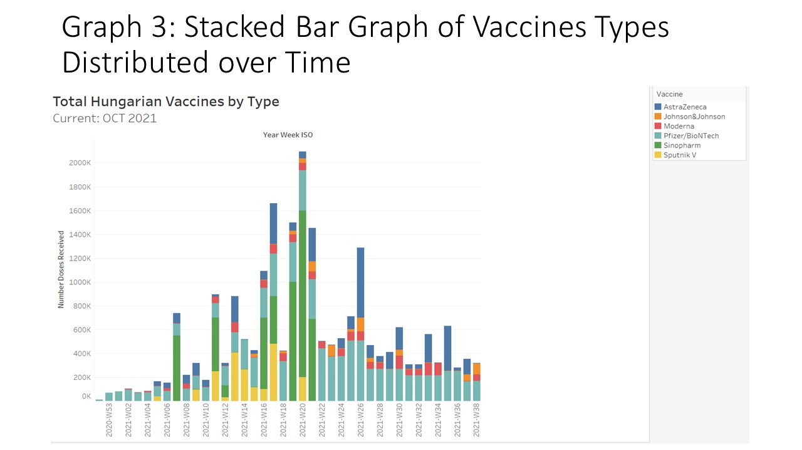

Frame 8:

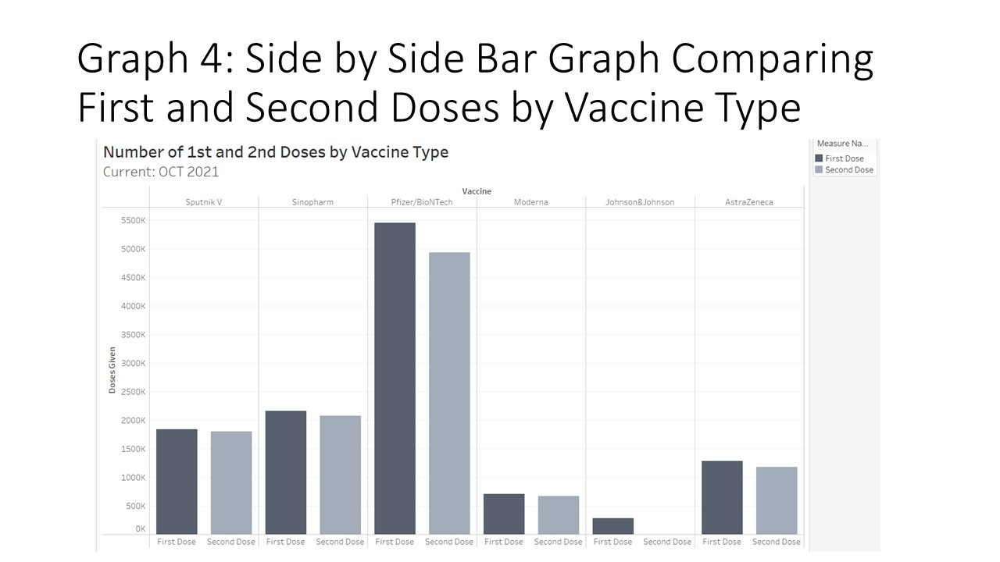

Frame 9: 
I realized after my user research that I need to revamp my graph on hashtags to articulate which ones are problematic rather than the language. This will better illustrate my point that almost all popular hashtags are either anti-vaccine or natural (could be used for or against vaccines).  Additionally, I should graph how many people could have received a vaccine by type and compare that to those that did. This helps establish a stronger link of legitimacy. If people feel strongly that the Chinese Vaccine is best, the data should show that all Sinopham vaccines were used. 

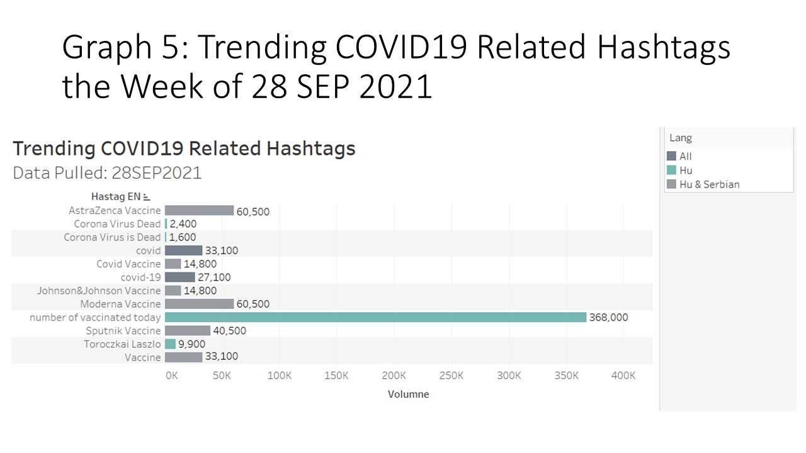

Frame 10:

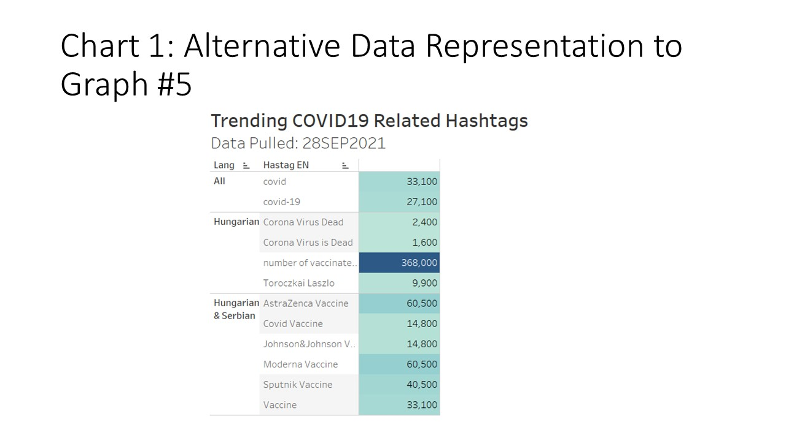

Frame 11:

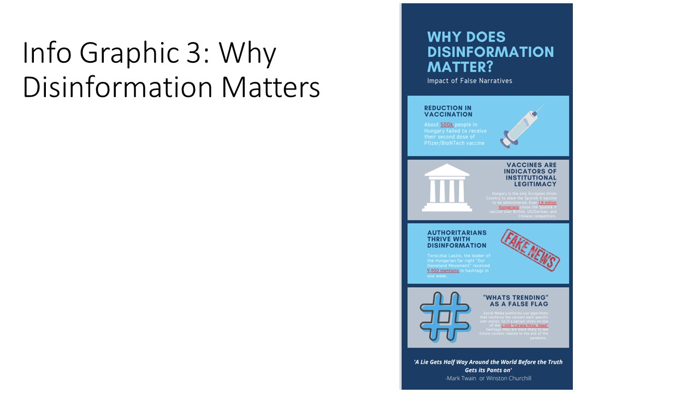

Frame 12: 

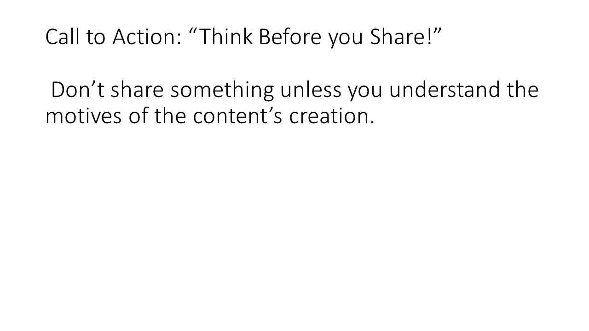

## User Research

Question & Response Person 1 (Female Student):

1. __What is the purpose of the visualizations?__	 The purpose of the visualisations are to draw attention to how Victor Orban has used the pandemic to solidify power and/or spread misinformation about COVID vaccines. [honestly, I found it a little hard to follow the storyboard without much background information on Hungary.]
2. __What is missing in the story?__ I think what is missing is the overall context of why this story is important, and also the level of COVID disinformation in Hungary. The graphics on hashtags seemed interesting but I struggled to understand them. 
3. __What works well?__ There was variation in the graphics which made the storyboard interesting (tables, bar graphs). Disinformation is also a “hot” topic that would normally spark interest. 
4. __Are their confusing graphs or graphics?__ If so which ones and which part of the visualization is confusing?	 
Graph 1 – The y-axis label is hard to read. The x-axis is also hard to read in the “Year Week” format. It’s hard to know what is the 16th week in 2020, maybe months might be easier, even though I know the weekly visualization is also more accurate. 

Graph 2 – I’m not entirely clear how the 3 tweets show how Victor Orban has used the COVID pandemic to solidify his rule. Not sure if perhaps more exposition is needed?

Graph 3 – I don’t really know what the main point is. I know it shows me the different type of vaccines given out in each week, but not certain what trend I’m looking for. I also don’t know what “Year Week ISO” means, 

Graph 4 – similar to 3, I know what this chart is saying but not sure what the main point is. Maybe it’s useful to put the main point in the subtitle, unless the audience is meant to interpret this on their own? Having gone to the end of the storyboard, I now realise that the disinformation led to a drop in second doses for Pfizer. Maybe changing the sequence would have made this chart clearer?

Graph 5 – I’m not sure what “Hu and Serbian” means or are? Without context, it’s hard to figure this graph out. I suppose that my attention is meant to be drawn to “Hu” which is a different color. 

Chart 1  - I realise now that Hu and Serbian mean Hungarian and Serbian. I’m still abit confused as to whether these are Hungarian and Serbian twitter accounts, if so, I don’t know why the Hungarian hashtags are a higher number than Hungarian & Serbian hashtags – I assume the former is a subset of the latter?
Info Graphic 3 – the text in each box is difficult to read because it’s small. I do like the call to action statement “Think before you click”. It’s catchy. 

5. __What questions do you have after reviewing the visualizations?__ 	
          1. what other real-life consequences are linked with disinformation (other like the Pfizer doses)?
          2. How did Orban use the pandemic to consolidate power? Was he the one behind the disinformation?
          3.what is Hungary’s COVID deaths compared to other countries?
          4. Are there similar levels of disinformation in other countries. 
          
6.__Which of the three mood boards do you prefer? (1, 2, or 3)__	 1

_Question & Response Person 1 (Female Elementary School Teacher):_

1. __What is the purpose of the visualizations?__ The visualizations tell about covid disinformation in Hungary.
2. __What is missing in the story?__  I am satisfied with the amount of information.
3.__What works well?__ The content is interesting and presented well.
4. __Are there confusing graphs or graphics?__ If so which ones and which part of the visualization is confusing?
Graph 5 could be updated to show which hashtags are potentially problematic. 
5. __What questions do you have after reviewing the visualizations?__ No questions
6. __Which of the three mood boards do you prefer? (1, 2, or 3)__ I prefer mood board #1. It is visually appealing

_Question & Response Person 1 (Male Student)_

1. __What is the purpose of the visualizations?__
The purpose is to show how Orban has benefitted from misinformation on social media, which is rampant and easy to spread. Misinformation
can cost lives, so it’s important to think about what you share.
2. __What is missing in the story?__ I think that there’s a lot of vaccine-content but the explanation of how it’s related is absent. Before showing vaccination statistics, at least in the final presentation, I’d make sure you include an infographic talking about vaccines meaning institutional legitimacy and why the Sinopharm
and Sputnik vaccines matter in Hungary. Vaccines, Hungary, and misinformation can certainly be all put in the same presentation cohesively, but getting it there may be difficult.
3. __What works well?__ Most of the graphics are really strong and highlight the necessary information well. The root purpose of the assignment, which is obviously telling the story with data, is done really well. I can get exactly what you’re trying to say.
4. __Are their confusing graphs orgraphics? If so which ones and which part of the visualization is confusing?__

Graph 3 comes across as a bit confusing to me. The multitude of colors is something I feel Chris will want us to avoid. Since there’s a focus on the institutional legitimacy, maybe a line graph that compares the vaccines from the 4 major regions here (US, EU, Russia, China) over
time would be a potential fix?

Graph 4 may be redundant- I’m not entirely sure what story it’s trying to tell by separating doses. I know you technically can get first dose Pfizer 2nd dose Moderna, for example, but the data doesn’t seem to reveal anything here. You obviously know your story better than I would, but from the storyboard that’s the impression I get. 

Graph 5- I like the alternative a lot! I would type out “Language of Tweet” or something like that to minimize confusion, but the separation
of colors of it work really well. The original works perfectly fine as well, if you want bar chart consistency.

5. __What questions do you have after reviewing the visualizations?__
I personally have none, because I got to talk to you about your goals with the presentation. I would just caution you to make sure you make this cohesive. I really like the messaging and know this will probably end up being a great presentation, but I’m worried that there’s a lot of topics to put in 60 seconds.
6. __Which of the three mood boards do you prefer? (1, 2, or 3)__ 1. This one comes across as the “friendliest”, while the other two seem deceptive. I know that feeling could be the purpose of the presentation, but think of how you want the reader to feel as they leave. #1 gives more of a “friendly reminder to be smart online” while #3 gives a “you should feel scared about using the internet”. Totally valid presentation to give for #3, but I’m not sure it fits your presentation style. #2 is fine, but I personally feel #1 fits your speaking style more

## Mood Board

I wanted to create a way to find the best color pallet for my story. I searched on Google Images for disinformation-related infographics and found that there were really three primary colors pallets used: blue/white, purple, and black/red color pallet. I will use the blue / white color pallet because it resonated the most during my user research and it also mirrors the colors used by Twitter. 

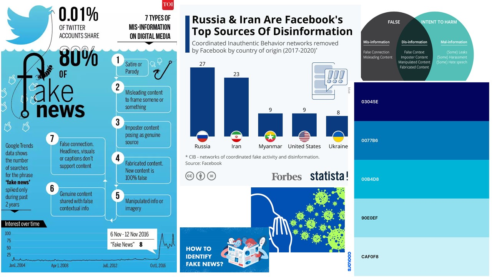

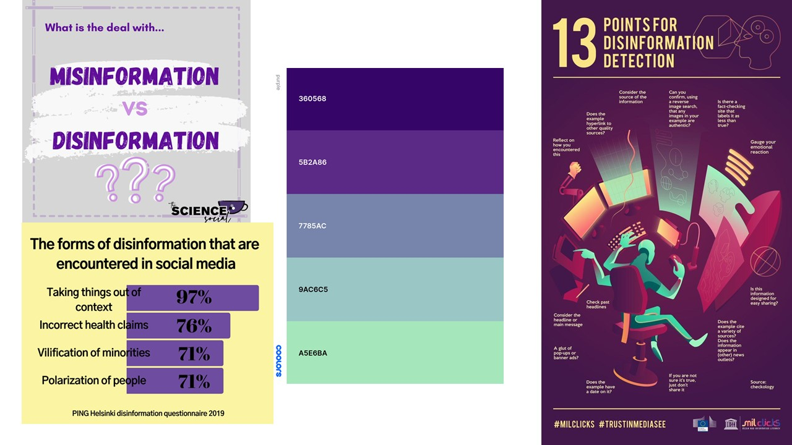

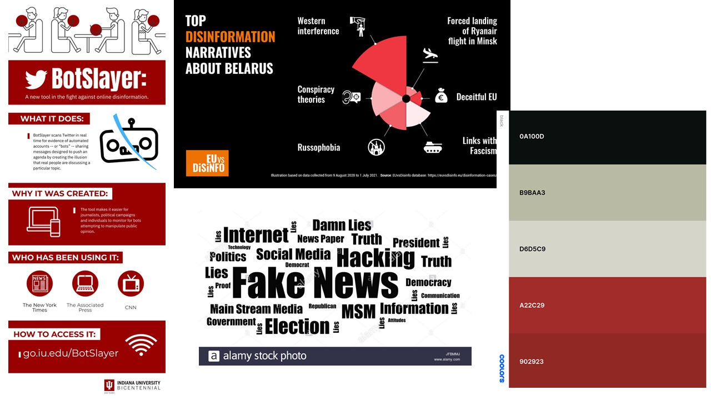

## Personas 

I created two user personas. One of a middle-aged man with little formal education but confident in his abilities and place in life. Too often, people are overconfident in their ability to discern what is fake and what is not. I want to appeal to those kinds of people by demonstrating that people desire to create misleading posts on social media. The second persona is more the young, white-collar worker immersed in technology and may not fully understand its effects on society. A secondary goal of the project is to raise awareness that the media we share can create real issues for people. 

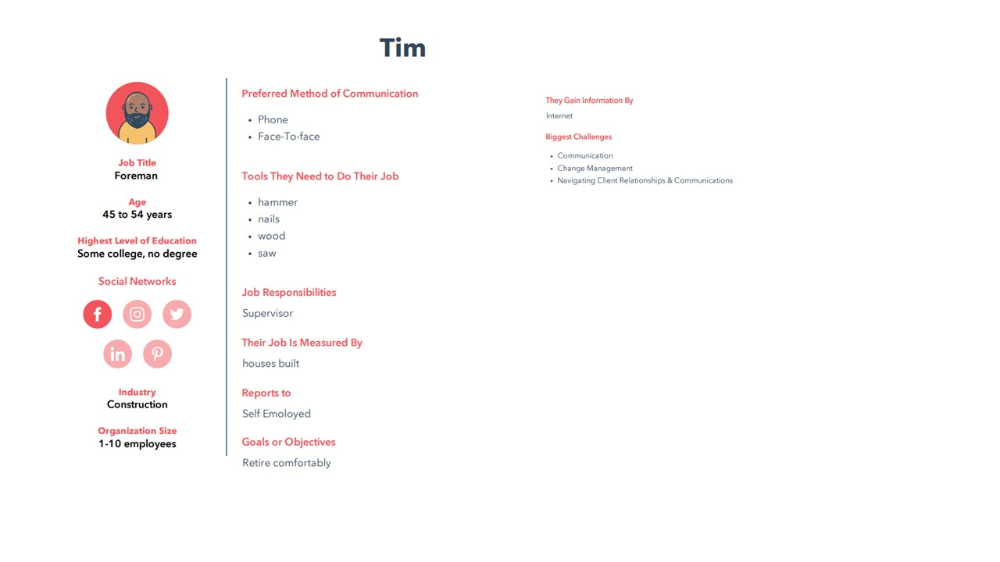

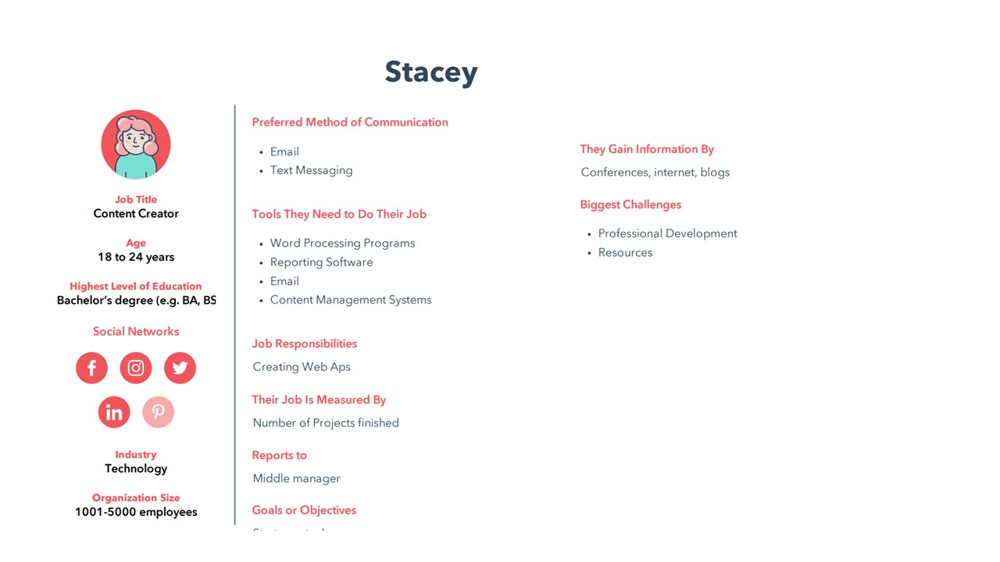

[Home](README.md)

[Final Project Part I](final_project_jreisher.md)

[Final Project Part III](final_project_partIII.md)
