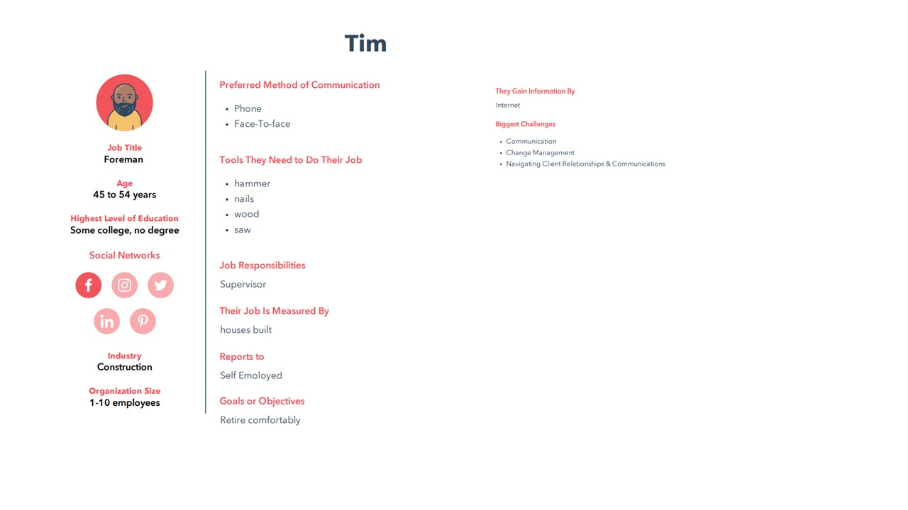
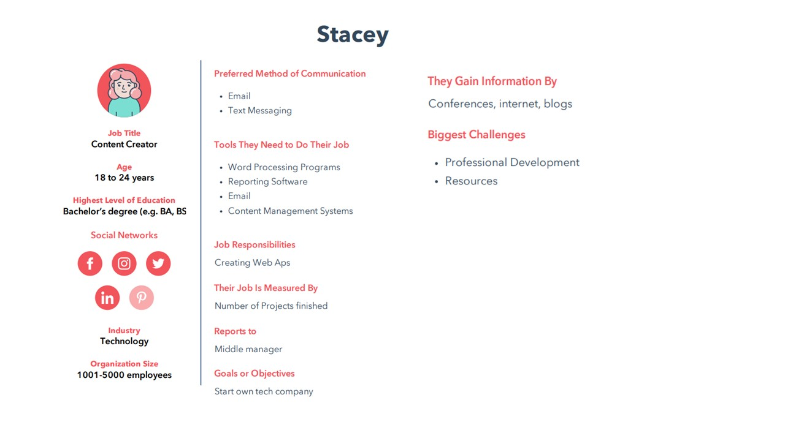

# Final Project Part III

## Project Reflection

#### Intended Audience 

 In [Part II](final_project_partII.md) I went over who Tim and Stacey are as personas. I wanted to try and think about who is the 'typical' consumer of social media. There are several generations now that have digital literacy because they know how the internet works and are capable of using a variety of devices like laptops, smartphones, or tablets. However, the baby boomer / Gen X / Elder Millenial user has a particular issue where, in their youth, they researched in a library. In a library, there is a sort of 'constitution' in terms of facts because all of the content in a library is reviewed and screened by professionals. Most libraries do not allow an encyclopedia set that only has false facts. When these mature internet users are online, they have issues decoupling from the idea that what they are finding could be fake or altered for a political purpose. I tried to personify this kind of user with Tim. With Tim, it is easy for him to believe falsehoods at face value. This corrodes useful political discourse because Tim eventually believes he is the only one with the 'real' facts.

The second kind of consumer of social media grew up with technology and the internet. Younger Millenials and GenZers have a much more sophisticated relationship with social media. But they are also far more consumed by the things they see online. They can get easily trapped in a self-affirming silo of facts that never allow them to engage with opposing or different ideas. Like Tim, Stacey is susceptible to being affected by disinformation. But for Stacey, it isn't about the facts as much as the narratives altering her behavior. It could potentially lead her to support causes that are unhelpful to a vibrant democracy. 

#### Summary 

During the final phase of production, I spent much time making and remaking elements of the story. The additional peer and family reviews of the project helped me refine the story that I was trying to tell about Twitter disinformation and its effect on the Hungarian democracy. I still feel like I am trying to cover many topics at once. However, I think people are starting to understand that disinformation is a problem. But they do not fully understand how corrosive disinformation is to democracy because democracy requires consensus. If everyone's facts are different, there is no way you can agree on anything. 

There were several things that I found helped me create the final product. The mood board really helped me figure out how to use color and design to link sections of the wire diagram that would not distract the reader's attention. Furthermore, I would have wasted a ton of time trying to match colors between elements and charts without the color pallet that I found on coolers. Another aspect that worked well was the creation of infographics on canva and infogram. I have a lot to say in my story. Creating a compelling picture of a complex idea is difficult, but it pays off if it quickly articulates the idea. I hope that my readers agree that I have expressed my thoughts effectively and without confusion. 

#### Final Data Visualization Link

[Final Data Viz](https://carnegiemellon.shorthandstories.com/covid19-disinformation-in-hungary/index.html)

## References 

European Centre for Disease Prevention and Control. “COVID-19 Situation Update for the EU/EEA, as of 4 October 2021.” Accessed October 4, 2021. https://www.ecdc.europa.eu/en/cases-2019-ncov-eueea.

Chris, Meserole. “How Misinformation Spreads on Social Media—And What to Do about It.” Brookings (blog), May 9, 2018. https://www.brookings.edu/blog/order-from-chaos/2018/05/09/how-misinformation-spreads-on-social-media-and-what-to-do-about-it/.

Francesco Guarasico. “EU Warns Hungary against Use of Russia’s COVID-19 Vaccine.” Reuters, November 19, 2020, sec. Financials. https://www.reuters.com/article/health-coronavirus-eu-hungary-idUSL1N2I41ZM.

“Hungary.” In The World Factbook. Central Intelligence Agency, September 29, 2021. https://www.cia.gov/the-world-factbook/countries/hungary/#people-and-society.

“Hungary: Government Uses Vaccine Campaign to Lash out at Political Opponents.” Deutsche Welle. Accessed October 6, 2021. https://www.dw.com/en/hungary-government-uses-vaccine-campaign-to-lash-out-at-political-opponents/a-57137738.

Jeff Orlowski. “The Social Dilemma.” Netflix, accessed January 6, 2021, https://www.netflix.com/title/812542. 

Maggie Gile. “Hungarian Foreign Minister Dismisses ‘Global Fake News’ Reports on LGBT Content Ban.” MSN News. Accessed October 6, 2021. https://www.newsweek.com/hungarian-foreign-minister-dismisses-global-fake-news-reports-lgbt-content-ban-1603027.

Pictures from NounProject.com

Shaun Walker. “Hungary Passes Law That Will Let Orbán Rule by Decree | Hungary" The Guardian. Accessed October 6, 2021. https://www.theguardian.com/world/2020/mar/30/hungary-jail-for-coronavirus-misinformation-viktor-orban.

[Home](README.md)

[Final Project Part I](final_project_partI)

[Final Project Part II](final_project_partII.md)

